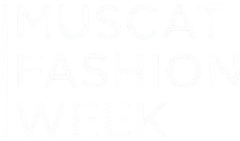

# Muscat Fashion Week

## About Muscat Fashion Week

Muscat Fashion Week is the premier fashion event in the region, showcasing the latest trends, designs, and talents from around the world. Our website is designed to provide all the details about the event, including the agenda, speakers, and contact information.

## Event Highlights

- **Event Agenda**: Stay updated with the schedule of events, including fashion shows, workshops, and panel discussions.
- **Speakers**: Learn more about the renowned designers, industry experts, and influencers participating in the event.
- **Contact Information**: Reach out to us for inquiries, sponsorship opportunities, or general information.
- **Other Event Details**: Explore additional information about the venue, ticketing, and special activities.

## Get Involved

We welcome everyone to join us in celebrating the art of fashion. Whether you're a designer, model, or fashion enthusiast, Muscat Fashion Week has something for you.

## License

The content and materials of Muscat Fashion Week are protected under copyright laws. For permissions, please contact us directly.
